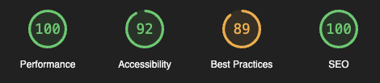
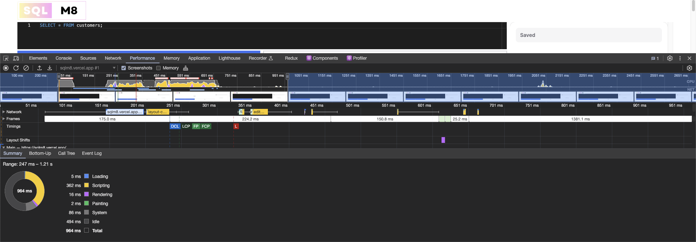

## SQLM8

SQLM8 is a web application that allows users to execute SQL queries and visualize the results. Below are the details of the project:

### Walkthrough Video

[Watch the walkthrough video](#) showcasing the implementation details and demonstrating how to execute queries in SQLM8.

### Framework and dependencies

- **Framework**: Next.js 14 (App Router) | React 18
- **Major dependencies**:
  - `@monaco-editor/react` for the SQL query editor
  - `tailwindcss` - for styling
  - `@nextui-org/react` for certain UI components
  - `framer-motion` for animations - requirement for nextui
  - `sqlite` and `sqlite3` for SQLite database handling & query execution

### Page Load Time

The detailed lighthouse benchmark report can be found here: [benchmark](./benchmarks.html)

### Optimizations

To decrease the load time and increase performance, the following optimizations were implemented:

- **Code Splitting**: Next.js automatically splits the code into smaller chunks, resulting in faster page loads.
- **Lazy Loading**: Components and libraries are lazily loaded to reduce the initial bundle size and improve load times.
- **Minification and Compression**: JavaScript and CSS files are minified and compressed to reduce file sizes and decrease load times.
- **Server-side Rendering (SSR)**: Next.js provides SSR out of the box, improving the perceived performance of the application by rendering pages on the server before sending them to the client. In this case, SSR is primarily used for SQL query execution in the SQLite database.

### How to Run

To run the SQLM8 application locally, follow these steps:

1. Clone the repository: `git clone https://github.com/theonly1me/sqlm8.git`
2. Navigate to the project directory: `cd sqlm8`
3. Install dependencies: `npm install`
4. Start the development server: `npm run dev`
5. Open your browser and visit `http://localhost:3000`

### License

This project is licensed under the MIT License
